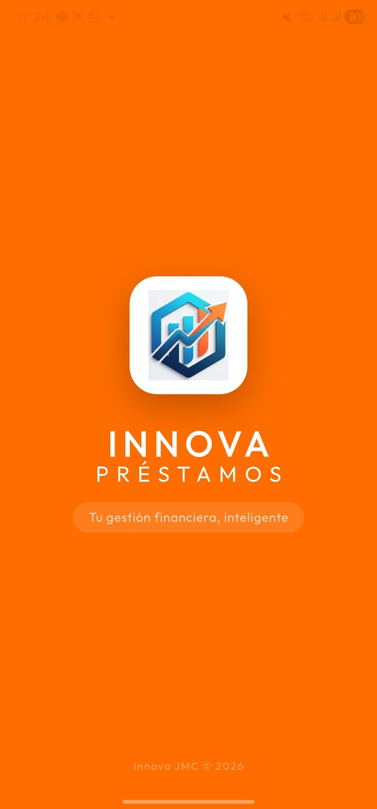
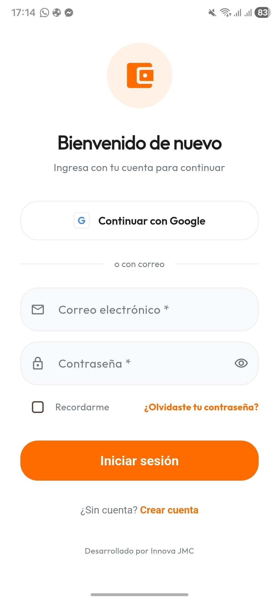
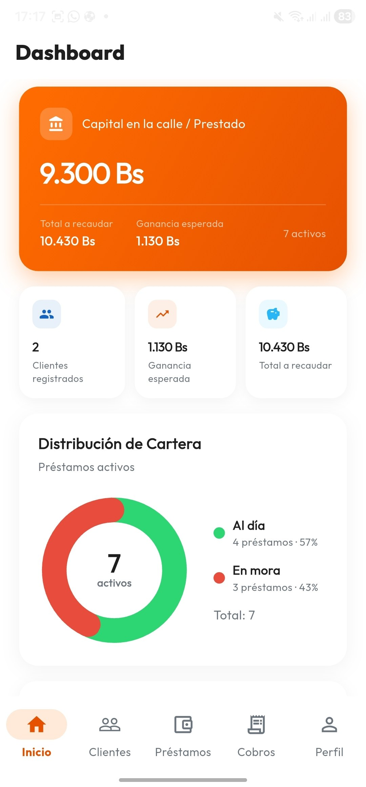
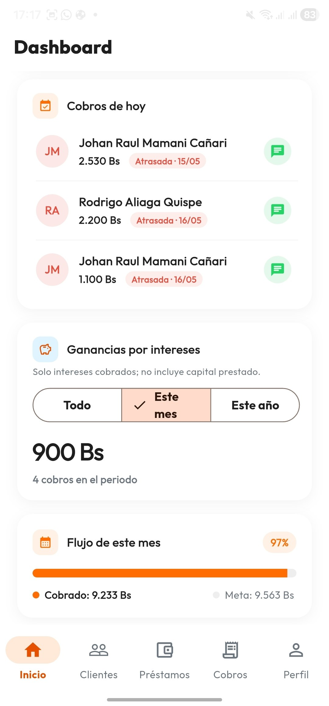
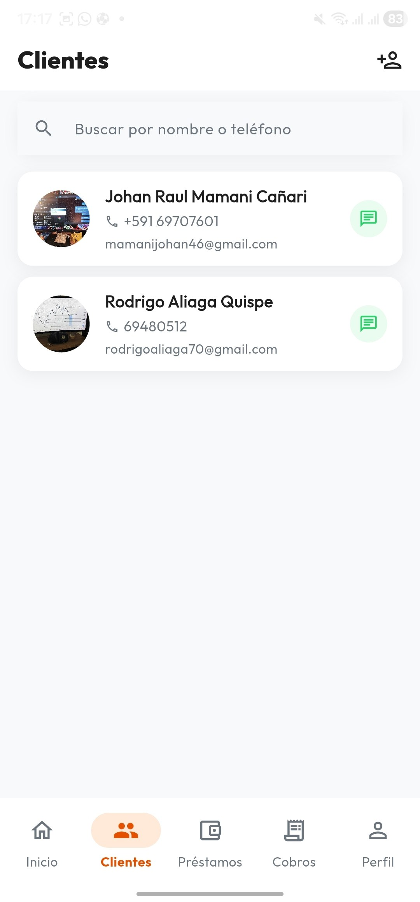
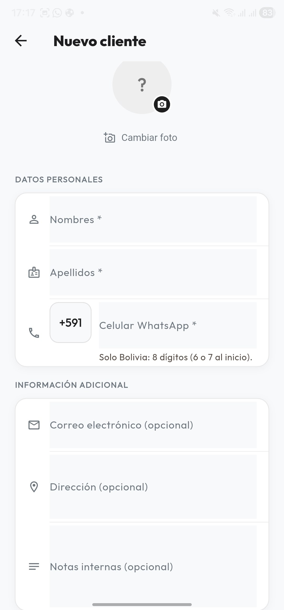
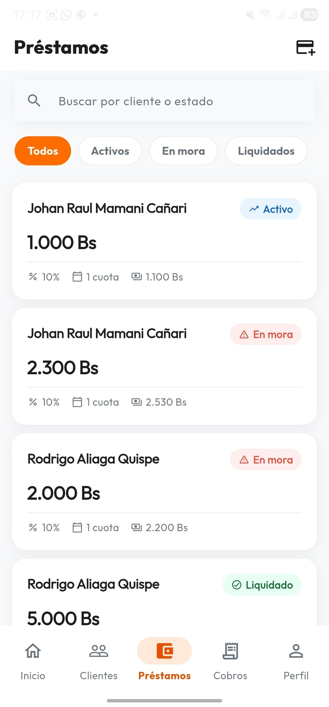
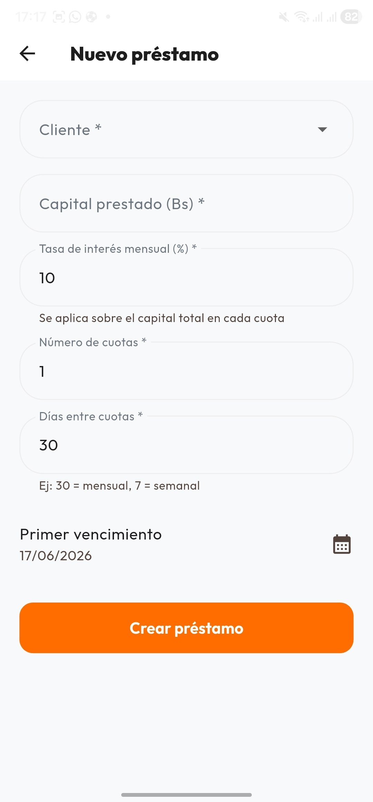
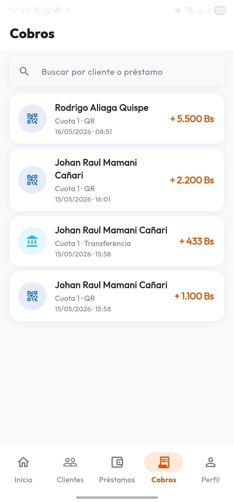
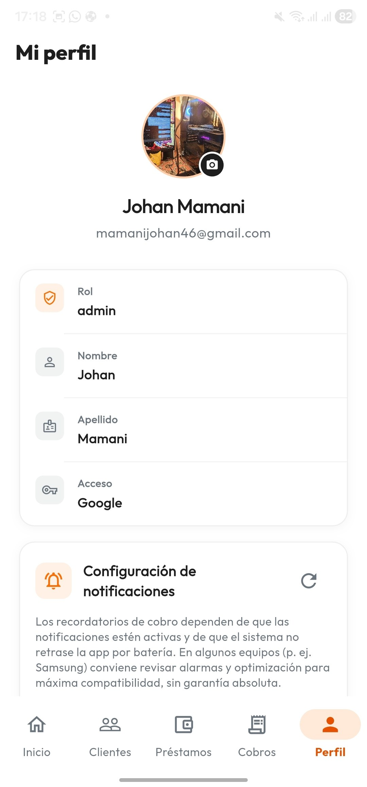

# 📱 INNOVA J.M.C. - Sistema de Préstamos

<div align="center">


**Ingeniería de Sistemas y Soluciones Tecnológicas**

*Proyecto comercial · Código no disponible públicamente*

</div>

---

## 🎯 Descripción

Aplicación móvil profesional para **gestión integral de préstamos**, **clientes**, **cuotas y cobros**, orientada al mercado boliviano. Pensada para prestamistas y microfinanzas que necesitan controlar el capital en la calle, detectar mora a tiempo, registrar pagos y comunicarse con sus clientes desde el celular.

Permite crear préstamos con interés configurable, calcular cuotas de forma automática, monitorear la cartera en tiempo real y recibir recordatorios de cobro. Los datos se sincronizan en la nube con acceso seguro por usuario.

---

## ✨ Funciones implementadas

| Módulo | Qué hace el sistema |
|--------|---------------------|
| **Inicio de sesión** | Acceso con correo y contraseña o con cuenta Google; opción de recordar sesión y recuperación de contraseña |
| **Dashboard** | Vista del capital prestado, ganancia esperada, total a recaudar y préstamos activos; gráfico de cartera al día vs. en mora |
| **Cobros del día** | Listado de cuotas que vencen hoy o están atrasadas, con acceso rápido a WhatsApp para recordar al cliente |
| **Ganancias** | Reporte de intereses cobrados (sin incluir capital), filtrable por mes, año o histórico completo |
| **Flujo mensual** | Barra de progreso con lo cobrado frente a la meta del mes |
| **Clientes** | Alta, edición y búsqueda por nombre o teléfono; foto de perfil, datos de contacto y notas internas |
| **Préstamos** | Creación con capital, tasa de interés, número de cuotas y días entre cuotas (semanal, mensual, etc.) |
| **Cálculo automático** | Generación del plan de cuotas con interés fijo sobre el capital y fechas de vencimiento |
| **Estados** | Seguimiento de préstamos activos, en mora y liquidados, con filtros en la lista |
| **Registro de cobros** | Pago de cuotas por efectivo, QR o transferencia, con historial detallado |
| **Comprobantes** | Generación y compartición de comprobantes de desembolso y de pago en PDF |
| **Impresión** | Emisión de tickets en impresora térmica Bluetooth (formato 80 mm) |
| **Notificaciones** | Recordatorios locales programados para cuotas que vencen o están atrasadas |
| **Perfil** | Datos del prestamista, rol de usuario y configuración de avisos de cobro |
| **Localización** | Moneda en Bs, calendario y horario Bolivia (America/La_Paz), interfaz en español |

---

## 🏗️ Stack tecnológico

- **App móvil:** Flutter (Android)
- **Interfaz:** Material Design, navegación por módulos, diseño responsive para celular
- **Estado de la app:** Riverpod
- **Navegación:** Go Router
- **Backend en la nube:** Firebase Authentication, Cloud Firestore y Firebase Storage
- **Autenticación:** Google Sign-In y correo electrónico
- **Sincronización:** Datos en tiempo real entre dispositivos del mismo usuario
- **Notificaciones:** Avisos locales programados para recordatorios de cobro
- **Documentos:** Comprobantes PDF generados y listos para compartir
- **Impresión:** Soporte para impresora térmica Bluetooth
- **Integraciones:** WhatsApp, cámara/galería para fotos de clientes
- **Distribución:** APK y App Bundle para Android

---

## 📸 Capturas del sistema

| Splash | Login | Dashboard |
|--------|-------|-----------|
|  |  |  |

| Dashboard (cobros) | Clientes | Nuevo cliente |
|--------------------|----------|---------------|
|  |  |  |

| Préstamos | Nuevo préstamo | Cobros |
|-----------|----------------|--------|
|  |  |  |

| Perfil |
|--------|
|  |

*Capturas de referencia del sistema en funcionamiento.*

---

## 📁 Módulos del sistema

```
Sistema de Préstamos
├── Autenticación (acceso seguro, Google, roles)
├── Dashboard (KPIs, cartera, cobros del día, ganancias)
├── Clientes (registro, búsqueda, contacto WhatsApp)
├── Préstamos (creación, cuotas, estados, comprobantes)
├── Cobros (registro de pagos e historial)
└── Perfil y notificaciones (avisos de cobro configurables)
```

---

## 📞 Autor y licencia

**Desarrollado por:** INOVA J.M.C.  
**Ingeniería de Sistemas y Soluciones Tecnológicas**

**Versión:** 1.0.0  

Este proyecto es **propietario**. El código fuente no está disponible públicamente.  
**© INNOVA J.M.C. - Todos los derechos reservados.**

---

*Este repositorio es de carácter informativo y portfolio. Para consultas comerciales o técnicas, contactar al titular del proyecto.*
